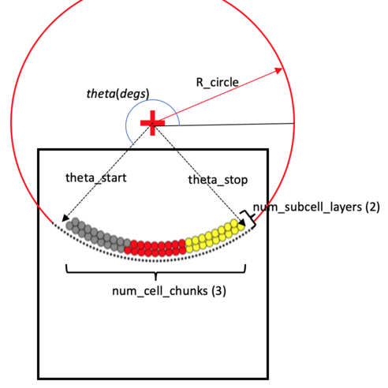

# pc4membrane2D

Studio GUI to explore test case of PhysiCell subcell mechanics near a membrane

Compile the C++ model:
```
cd src
make

# copy the executable to where the Studio wants it:
mv myproj ..

# Change directory to the root dir and run the GUI from there
cd ..
python bin/studio.py
```

In the GUI:
* in the Run tab, click `Run Simulation`. Note: the simulation is run *from* the `tmpdir` directory and that's where all output files will be written.
* in the Plot tab, click `Play`.
* edit params if you want then repeat: Run, Play.
* the diagram shows the User Params that define the membrane's curvature and create subcells near the membrane. The center of the circle will be defined at x=0 and y=R_circle so that the bottom of the circle touches y=0 of the domain. Therefore, it would be best to retain a square domain, centered at 0,0.
* the radius of a subcell will be determined from the `Cell Types (tab) | Volume (subtab) | total` (and V = 4/3 * pi * r^3)


